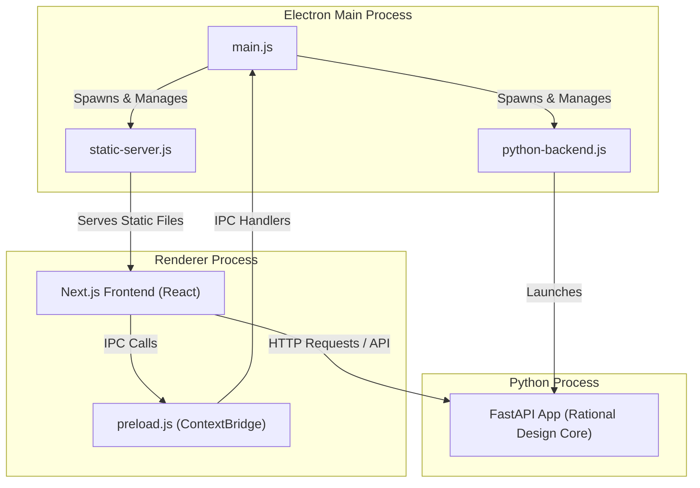
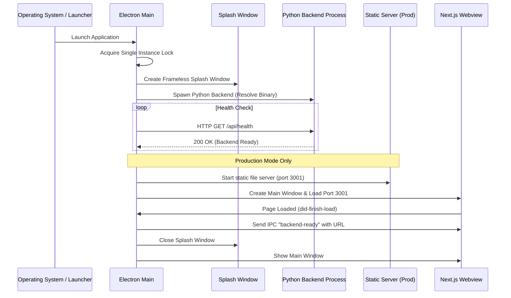

# Electron Application Architecture

This document describes the architecture, process model, and component layout of the Electron-based desktop application for **Rational Primer Design**.

---

## 1. High-Level Architecture Overview

The desktop application is built as a hybrid desktop app combining a Next.js single-page application (SPA) frontend, an Electron shell container, and a FastAPI-based Python backend.



The application relies on three distinct layers:
1. **Electron Main Process**: Orchestrates the system lifecycle, manages windows, runs a local static file server (in production), and spawns/manages the Python backend.
2. **Renderer Process (UI)**: Displays the React interface built with Next.js. Communications with the local operating system go through a secure preload bridge.
3. **Python Backend**: Handles complex computational logic, sequence alignments, *in silico* PCR, and database queries. It exposes a REST API via FastAPI.

---

## 2. Key Components & Files

All Electron-related files are located in the [electron/](file:///Users/thanhnt/Desktop/GitHub/primer_design_tool/electron) directory:

### 📄 [main.js](file:///Users/thanhnt/Desktop/GitHub/primer_design_tool/electron/main.js)
The core entry point of the desktop application.
- **Single Instance Lock**: Ensures only one instance of the application runs at a time using `app.requestSingleInstanceLock()`.
- **Window Management**:
  - `loadingWindow`: A frameless splash screen displaying a CSS loading indicator while the Python backend starts up.
  - `mainWindow`: The main application window containing the browser view for the user interface.
- **Lifecycle Coordination**: Coordinates starting and stopping both the Python backend and the frontend static server, and binds application menu configurations.
- **IPC Handlers**: Registers listeners to expose the backend URL and application version to the renderer process.

### 📄 [preload.js](file:///Users/thanhnt/Desktop/GitHub/primer_design_tool/electron/preload.js)
A secure bridge between the isolated frontend context and the Electron main process.
- Uses `contextBridge` to expose a safe, minimal subset of APIs under `window.electronAPI`.
- Prevents security risks by keeping `nodeIntegration: false` and `contextIsolation: true`.
- Exposes:
  - `getBackendUrl()`: Retrieve the Python FastAPI address.
  - `onBackendReady(callback)`: Listen for the backend service startup signal.
  - `getAppVersion()`: Retrieve the current version.
  - `platform`: Retrieve the host operating system platform (e.g., `darwin`, `win32`, `linux`).

### 📄 [python-backend.js](file:///Users/thanhnt/Desktop/GitHub/primer_design_tool/electron/python-backend.js)
Controls the lifecycle of the FastAPI server.
- **Binary Resolution (`resolveBinary`)**:
  - In **Development** (or when the compiled binary is missing): Locates the virtual environment Python interpreter (`venv/bin/python` or `venv/Scripts/python.exe`) and runs the Python module `rational_design.api_server`.
  - In **Production**: Runs the compiled executable (`api_server` or `api_server.exe`) generated by PyInstaller.
- **Server Health Probing (`waitForServer`)**:
  - Spawns the child process and immediately begins polling the backend's `/api/health` endpoint.
  - Resolves when a `200 OK` response is received, or rejects after a 20 seconds timeout.
- **Process Termination (`stopBackend`)**:
  - Safely kills the spawned Python process tree. On Unix systems, it kills the process group; on Windows, it uses `taskkill` to guarantee sub-processes are terminated cleanly.

### 📄 [static-server.js](file:///Users/thanhnt/Desktop/GitHub/primer_design_tool/electron/static-server.js)
A lightweight HTTP server written in native Node.js.
- Used in **Production** mode to serve the statically exported Next.js bundle (`frontend/out`) on `http://127.0.0.1:3001`.
- Implements correct MIME-type mappings for web assets (HTML, JS, CSS, JSON, images, fonts).
- Provides routing fallbacks so that direct URL hits are mapped correctly to their matching static HTML pages (supporting clean Next.js export routing).

---

## 3. Application Lifecycle Flow

### Startup Flow


### Shutdown Flow
1. User closes all windows (or triggers Quit).
2. Electron receives the `before-quit` event.
3. `stopBackend()` is called to terminate the Python server process tree.
4. `stopFrontendServer()` is called to stop the local HTTP server.
5. Electron shuts down cleanly.

---

## 4. Build, Development, and Packaging Commands

The project configuration in [package.json](file:///Users/thanhnt/Desktop/GitHub/primer_design_tool/package.json) maps scripts for building and packaging the hybrid application:

- **Development Launch**:
  ```bash
  npm run dev
  ```
  Runs Next.js in development mode (port 3001) and concurrently launches Electron pointing to it, while spawning the Python backend via the local `venv` environment.

- **Production Build Sequence**:
  1. **Build Frontend**: Compiles and exports the Next.js site to static HTML/CSS/JS.
     ```bash
     npm run build:frontend
     ```
  2. **Build Backend**: Packages the Python backend into a single executable using PyInstaller.
     ```bash
     npm run build:backend
     ```
  3. **Package Desktop Installer**: Uses `electron-builder` to package the static frontend files, main process, and compiled Python backend binary into operating system installers (`.dmg`, `.exe`, `.deb`, `.AppImage`).
     ```bash
     npm run package:mac
     # or npm run package:win
     # or npm run package:linux
     ```
